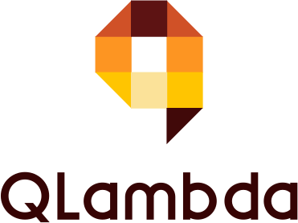

<h1 align="center">
    <a href="#">
        
    </a>
</h1>
<h4 align="center">
	✴️ A portfolio of AWS Serverless apps ✴️
</h4>

<div align="center">

[](https://git.io/gradientbadge)&nbsp;&nbsp;[](https://reactjs.org/)&nbsp;&nbsp;[](https://git.io/gradientbadge)

_Quick View:_

[00][0]&nbsp;&nbsp;&nbsp;|&nbsp;&nbsp;&nbsp;

</div>

**QLambda** is a project dedicated to learning about serverless computing on AWS. The serverless applications are built following online tutorials and sometimes adapted to suit the purpose of this project. In this way, techniques and tools from various implementations are discovered.

<!--
TODO: Insert a pic of the web page
-->

### Overview

A summary of the examples found in this project.

<!--
TODO: Add demo links
-->

| Name                                | Tech                 | Description                                                   |
| ----------------------------------- | -------------------- | ------------------------------------------------------------- |
| 00. [React Amplify Auth Service][0] | Amplify CLI, Cognito | Simple authentication in React using AWS Amplify and Cognito. |

### How To Use

QLambda requires [Node.js](https://nodejs.org/) v10 or more recent. [Yarn package manager](https://yarnpkg.com/) and an [AWS account](https://aws.amazon.com/getting-started/) is also needed. This project is structured as a monorepo using yarn workspaces. From your command line:

```bash
# Clone this repository
$ git clone https://github.com/elitenoire/QLambda.git

# Go into the repository
$ cd QLambda

# Install dependencies
$ yarn install -g @aws-amplify/cli
$ cd examples/~insert~example~name && yarn install

# Configure Amplify
$ amplify init

# Add Amplify Auth
$ amplify add auth
  <accept defaults>
  ...
$ amplify push

# Run the app
$ yarn start
```

#### Credits

- Logo design by [Logofury](https://www.logofury.com/)

[0]: /examples/react-amplify-auth-service 'React Cognito Authentication'
